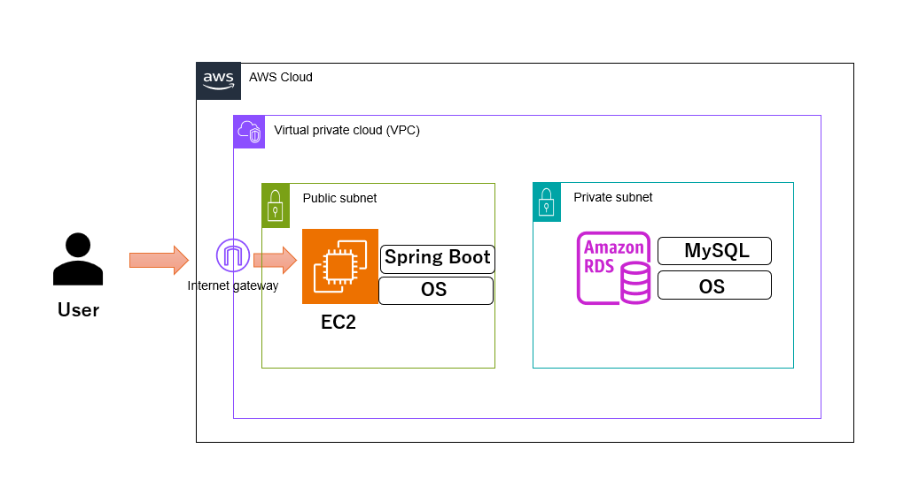

朝活の記録を残しておけるwebアプリ

# 朝活記録アプリ

自身の朝活の予定、記録や朝活に関する悩みなどを相談できるサービス

## URL

<http://43.207.212.203:8080>

## 技術スタック
* フロントエンド：HTML,CSS,Thymeleaf
* バックエンド：Java,SpringBoot
* データベース：Mysql

## 全体像
* 構成図

## 今後の課題
* 他のユーザの朝活記録の閲覧やいいね機能の追加
* 自身の朝活のリマインド機能追加　など
